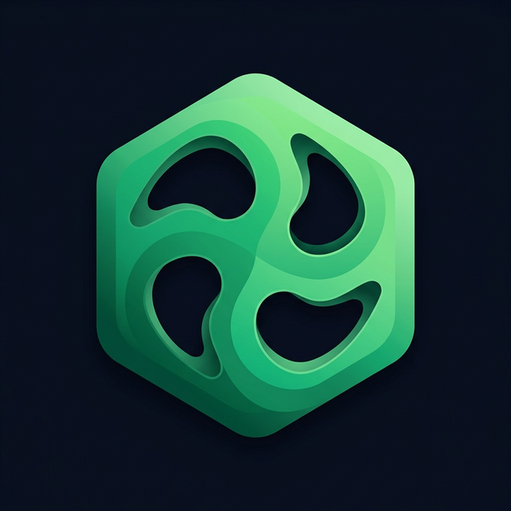

<div align="center">

# 🇧🇯 MonBénin

### La Super Application Citoyenne du Bénin



**MonBénin** est une application mobile tout-en-un qui centralise les services citoyens du Bénin.
Gérez vos documents, payez vos factures, consultez votre dossier citoyen et interagissez avec
une IA citoyenne — le tout depuis votre smartphone.

</div>

---

## 📱 Aperçu

MonBénin réunit tous les services essentiels du citoyen béninois en une seule application :

| Fonctionnalité | Description |
|---|---|
| **Authentification NPI** | Connexion via NPI + mot de passe avec vérification SMS |
| **Tableau de bord** | Vue d'ensemble avec alertes proactives et accès rapide aux services |
| **Documents** | CNI, Permis, Carnet de Santé — statut et renouvellement |
| **Factures** | Consultation et paiement SBEE, SONEB, Impôts |
| **IA Citoyenne** | Assistant intelligent avec paiement intégré dans le chat |
| **Opportunités** | Offres d'emploi, bourses, appels d'offres |
| **Profil** | Informations personnelles, paramètres, thème sombre/clair |

---

## 🏗️ Architecture

```
MonBeninMobile/
├── App.js                    # Navigation principale + Auth flow
├── src/
│   ├── AuthContext.js        # Gestion de l'état d'authentification
│   ├── ThemeContext.js       # Gestion du thème sombre/clair
│   ├── theme.js              # Palette de couleurs + profil IA
│   └── screens/
│       ├── AuthScreen.js     # Connexion / Inscription + SMS
│       ├── HomeScreen.js     # Tableau de bord principal
│       ├── AIChatScreen.js   # Chat IA + paiement intégré
│       ├── FacturesScreen.js # Gestion des factures
│       ├── DocsScreen.js     # Liste des documents
│       ├── CNIScreen.js      # Détail CNI
│       ├── OpportunitesScreen.js # Opportunités
│       ├── ProfilScreen.js   # Profil + déconnexion
│       └── SimpleServiceScreen.js # Écran générique de service
├── assets/
│   └── logo.png              # Logo de l'application
└── package.json
```

---

## 🚀 Installation

### Prérequis

- **Node.js** 18+
- **npm** ou **yarn**
- **Expo CLI** (`npx expo`)
- Un appareil mobile ou émulateur (iOS/Android)

### Étapes

```bash
# 1. Cloner le dépôt
git clone <url-du-repo>
cd MonBeninMobile

# 2. Installer les dépendances
npm install

# 3. Configurer l'API Gemini (pour le chat IA)
# Créer un fichier .env à la racine du projet :
echo "EXPO_PUBLIC_GEMINI_API_KEY=votre_cle_api_ici" > .env

# 4. Lancer l'application
npx expo start
```

Scannez le QR code avec **Expo Go** sur votre téléphone, ou appuyez sur `i` (iOS) / `a` (Android).

---

## 🛠️ Technologies

| Technologie | Version | Usage |
|---|---|---|
| **React Native** | 0.81.5 | Framework mobile |
| **Expo** | SDK 54 | Plateforme de développement |
| **React Navigation** | 7.x | Navigation (Tabs + Stack) |
| **Lucide Icons** | 0.575 | Icônes vectorielles |
| **Expo Linear Gradient** | 15.x | Dégradés visuels |
| **Google Gemini API** | 2.5 Flash | Intelligence artificielle |

---

## 🔐 Flux d'authentification

```
┌─────────────────────┐
│   ÉCRAN DE CONNEXION │
│                     │
│  ┌─ Connexion ────┐ │      ┌──────────────────┐
│  │ NPI *          │ │      │ VÉRIFICATION SMS │
│  │ Mot de passe * │ │ ───► │                  │
│  └────────────────┘ │      │  Code 6 chiffres │
│                     │      │  [_ _ _ _ _ _]   │
│  ┌─ Inscription ──┐ │      │                  │
│  │ NPI *          │ │      │  Renvoyer (60s)  │
│  │ Nom            │ │ ───► │                  │
│  │ Email          │ │      └────────┬─────────┘
│  │ Téléphone      │ │               │
│  │ Mot de passe * │ │               ▼
│  └────────────────┘ │      ┌──────────────────┐
└─────────────────────┘      │   APPLICATION    │
                             │   PRINCIPALE     │
                             └──────────────────┘
```

---

## 💳 Paiement dans le Chat IA

L'application permet de **payer ses factures directement dans le chat** :

1. **L'utilisateur demande** : *"Je veux payer ma facture d'eau"*
2. **L'IA détecte** l'intention de paiement et affiche un bouton
3. **L'utilisateur clique** sur "Payer" → Modal de confirmation
4. **Modification du numéro** : Possibilité de changer le numéro MoMo
5. **Paiement simulé** : Barre de progression → Reçu complet

### Factures supportées

| Service | Fournisseur | Montant démo |
|---|---|---|
| Eau | SONEB | 14 200 FCFA |
| Électricité | SBEE | 28 400 FCFA |
| Internet | Fibre | 18 500 FCFA |
| Impôts | Trésor Public | 45 000 FCFA |
| Assurance | NSIA | 85 000 FCFA |

---

## 🎨 Design System

### Palette de couleurs

| Couleur | Hex | Usage |
|---|---|---|
| 🟢 Primary | `#00B074` | Actions principales, boutons |
| 🟢 Primary Light | `#00E08E` | Accents, badges actifs |
| 🟡 Amber | `#F5A623` | Alertes, avertissements |
| 🔴 Red | `#EF4444` | Erreurs, badges urgents |
| ⚫ Bg Dark | `#0A0E17` | Fond principal (mode sombre) |
| ⬜ Bg Card | `#141924` | Cartes (mode sombre) |

### Thème

L'application supporte **2 thèmes** :
- **Mode sombre** (par défaut) — fond noir profond avec accents verts
- **Mode clair** — fond blanc avec accents verts adaptés

Le toggle se trouve dans **Profil > Apparence**.

---

## 📁 Écrans

### 🏠 Accueil (`HomeScreen`)
- En-tête avec nom et NPI vérifié
- Carte IA citoyenne avec suggestions
- Alertes proactives (assurance, CNSS, factures)
- Grille de services rapides
- Carrousel de documents

### 🤖 Chat IA (`AIChatScreen`)
- Chat en temps réel avec Gemini AI
- Suggestions rapides en chips
- Paiement intégré dans les bulles
- Modal de paiement complète

### 🔐 Authentification (`AuthScreen`)
- Toggle Connexion / Inscription
- Validation des champs en temps réel
- Vérification par code SMS
- Animations fluides

### 👤 Profil (`ProfilScreen`)
- Informations personnelles
- Paramètres (notifications, sécurité, langue)
- Toggle thème sombre/clair
- Bouton de déconnexion

---

## 🤝 Contribuer

1. Fork le projet
2. Créer une branche (`git checkout -b feature/ma-fonctionnalite`)
3. Commiter les changements (`git commit -m "Ajout de ma fonctionnalité"`)
4. Push la branche (`git push origin feature/ma-fonctionnalite`)
5. Ouvrir une Pull Request

---

## 📄 Licence

Ce projet est sous licence **MIT**. Voir le fichier `LICENSE` pour plus de détails.

---

<div align="center">

**Fait avec ❤️ pour les citoyens du Bénin**

*MonBénin v2.0 · SDK 54*

</div>
